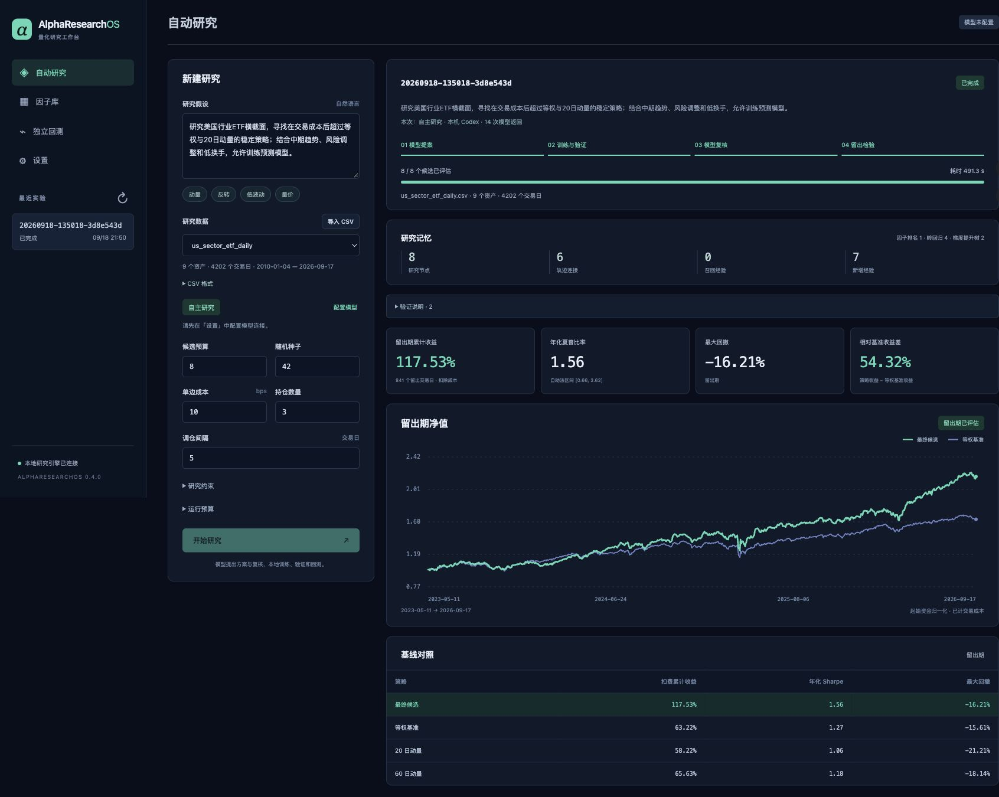
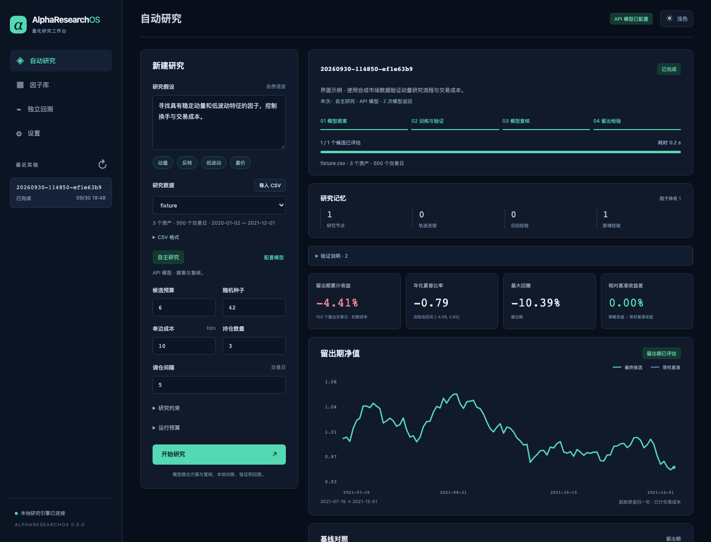
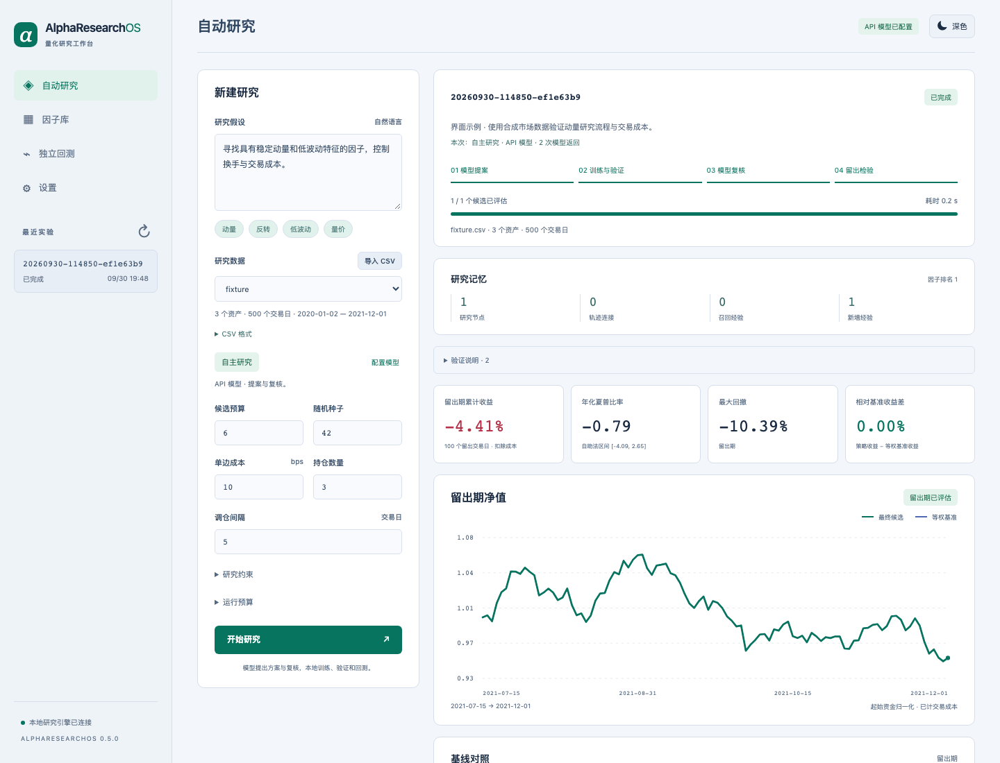
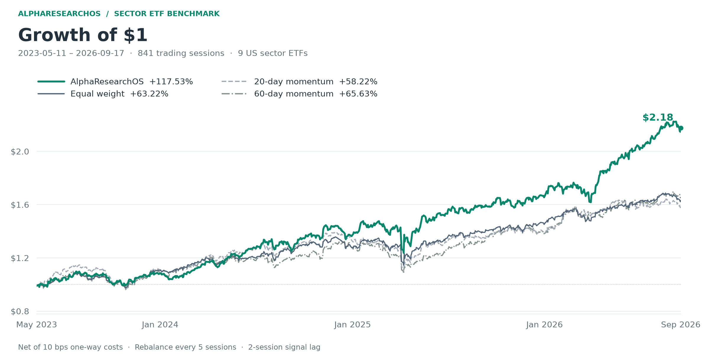
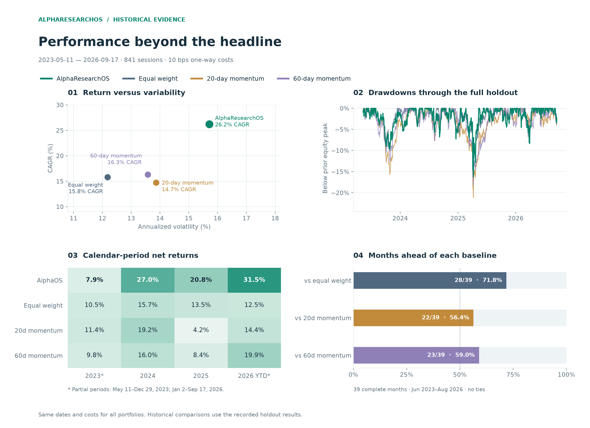
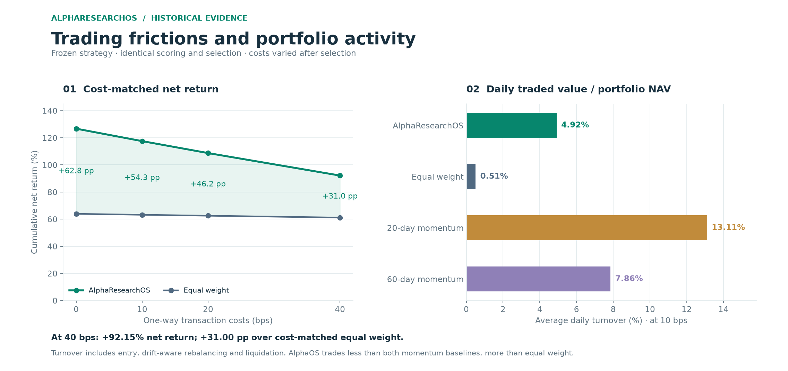

<div align="center">

<h1>AlphaResearchOS</h1>
<p><strong>自主量化研究工作台</strong></p>
<p>从市场数据出发，提出研究假设、训练预测模型、形成可复现、可审计的策略。</p>

<p><a href="README.md">English</a> &nbsp;|&nbsp; <strong>简体中文</strong></p>

<p>
  
  
  <a href="LICENSE"></a>
</p>

<p><a href="#快速开始">快速开始</a> · <a href="#行业-etf-表现">行业 ETF 表现</a> · <a href="docs/USER_GUIDE.md">使用指南</a></p>

</div>

AlphaResearchOS 将量化研究流程整合进本地工作台。导入标准 OHLCV CSV，连接 Codex 或兼容模型 API，输入希望研究的策略方向，即可开始实验。

**研究假设 → 特征与模型 → 开发评价 → 独立复核 → 迭代 → 留出评价**



## 主要功能

| 自主研究 | 复核与管理 | 结果分析 |
| --- | --- | --- |
| 提出假设并生成 1–6 个特征表达式 | 使用新的模型会话复核每个有效候选 | 对照等权、20 日和 60 日动量基线 |
| 比较排名组合、岭回归与直方图梯度提升 | 查看父轨迹、研究理由和后续实验 | 分析净值、回撤、换手与成本敏感性 |
| 开发期经验与 UCB 父节点选择指导搜索 | 设置请求、候选、时间和 token 准入预算 | 管理因子库，导出完整研究报告 |

顶部按钮可切换 **暗色与亮色主题**；首次使用跟随系统，手动选择后自动记住偏好。

<details>
<summary>暗色与亮色界面预览</summary>

以下为使用合成演示数据的界面预览。





</details>

## 快速开始

Python 3.11–3.13 · macOS / Linux · Windows 可使用 WSL2

```bash
uv sync --locked
uv run alphaos serve
```

打开 [http://127.0.0.1:8765](http://127.0.0.1:8765/)，按以下顺序操作：

1. **体检并导入数据**：点击 **导入 CSV**，预览资产覆盖、共同日期与校验结果，再确认导入。
2. **连接模型**：选择已登录的 **Codex CLI**、DeepSeek / Gemini / Ollama 预设或自定义兼容 API；填写模型 ID，保存后测试结构化返回。
3. **开始研究**：选择导入的数据，填写研究方向和预算，查看候选提案、训练、复核与评价过程。

CSV 使用以下标准字段：

```csv
date,symbol,open,high,low,close,volume
```

使用 UTF-8，包含 **3–100 个资产**，保持每日数据对齐与价格复权口径一致。默认配置的自动研究需要 **至少 468 个共同交易日**；导入器可接受 400 日起的数据。同一日期、同一资产只能出现一条记录。详见[数据格式](docs/USER_GUIDE.md#standard-csv)。

新研究默认使用 **6 个候选、12 次模型请求和 900 秒**。全部特征、模型参数、审阅决定和开发结果会保存在同一工作台中。[模型连接与预算设置 →](docs/USER_GUIDE.md#model-connections)

## 行业 ETF 表现

在 **9 只美国行业 ETF** 上，AlphaResearchOS 选出的双特征岭回归策略，在 **2023-05-11 至 2026-09-17** 期间计入 **单边 10 bps 交易成本**后，取得 **117.53% 累计收益、26.22% CAGR 和 1.5608 夏普比率**。

数据覆盖 **2010-01-04 至 2026-09-17**。训练和候选选择使用 **2023-05-08** 及之前的历史；下表与图表对应其后的 841 日留出期。所有策略每 5 个交易日调仓，AlphaResearchOS 与动量基线持有排名前 3 只资产，等权基线持有全部 9 只。



| 策略 | 累计收益 | CAGR | 夏普 | 最大回撤 | 年化波动 |
| --- | ---: | ---: | ---: | ---: | ---: |
| **AlphaResearchOS · 岭回归** | **117.53%** | **26.22%** | **1.5608** | -16.21% | 15.71% |
| 全资产等权 | 63.22% | 15.81% | 1.2662 | **-15.61%** | **12.18%** |
| 20 日动量 | 58.22% | 14.74% | 1.0615 | -21.21% | 13.86% |
| 60 日动量 | 65.63% | 16.32% | 1.1823 | -18.14% | 13.57% |

策略累计收益相对等权高 **54.32 个百分点**，相对 20 日、60 日动量分别高 **59.31**、**51.90 个百分点**。夏普高于三条基线，同时年化波动也更高；最大回撤比等权深 0.60 个百分点。



在 **39 个完整月份**中，策略有 **28 个月（71.8%）**跑赢等权，**22 个月（56.4%）**跑赢 20 日动量，**23 个月（59.0%）**跑赢 60 日动量。2024、2025 及 2026 年截至 9 月 17 日均领先三条基线，但在 2023 年局部窗口落后。图中保留了全部年度和完整回撤路径。

<details>
<summary><strong>执行维度：交易成本与换手</strong></summary>

在 **单边 40 bps 成本**下，策略累计收益为 **92.15%**，相同成本下的等权为 **61.15%**。在 10 bps 基准配置下，策略日均换手率为 **4.92%**：相对 20 日动量低 **62.50%**，相对 60 日动量低 **37.39%**，但高于等权的 **0.51%**。



</details>

[方法、开发结果与图表复现](docs/BENCHMARK.md) · [原始基准证据](benchmarks/sector-etf/results.json) · [派生诊断数据](benchmarks/sector-etf/analysis_metrics.json)

## 研究如何执行

特征通过有界 OHLCV 表达式执行。预测训练使用已成熟标签，每个开发折和最终留出窗口均采用窗口前固定的模型拟合。独立模型会话根据开发证据复核候选、提出下一步实验；通过复核的候选按开发评分竞争，再对最终策略进行评价。

工作台提供可执行的窗口、字段和换手约束，支持暂停、恢复和因子库搜索。[研究方法 →](docs/METHODS.md)

## 开发

```bash
uv sync --locked --extra dev
uv run pytest -q
uv run ruff check src/alpharesearchos scripts
node --check src/alpharesearchos/static/app.js
uv build
```

[参与贡献](CONTRIBUTING.md) · [路线图](ROADMAP.md) · [更新记录](CHANGELOG.md)

## 许可证

项目采用 [MIT License](LICENSE)。第三方署名见 [NOTICE](NOTICE.md)，数值组件说明见 [UPSTREAM.md](docs/UPSTREAM.md)。
