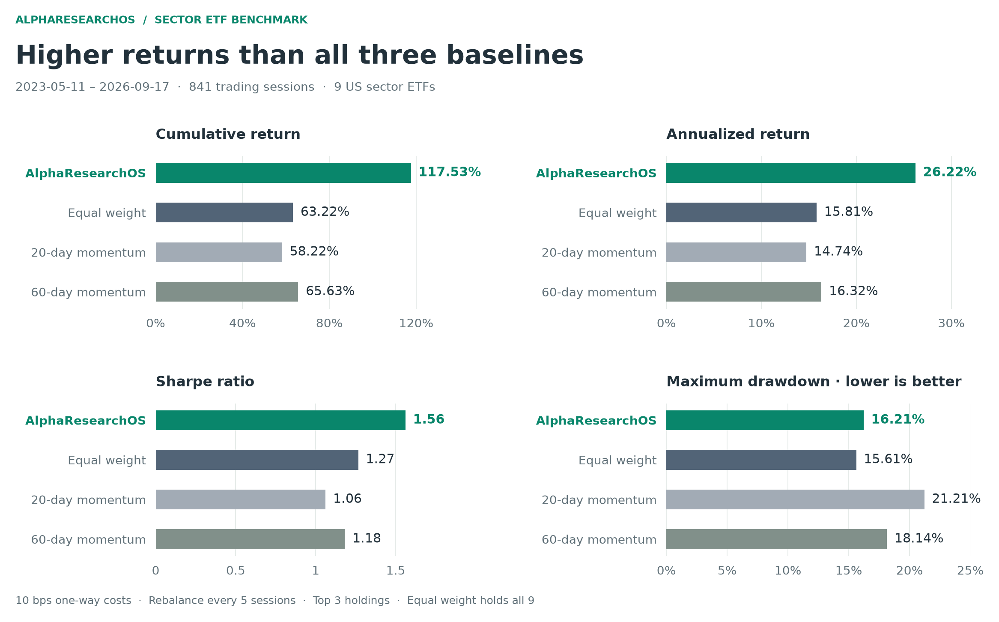
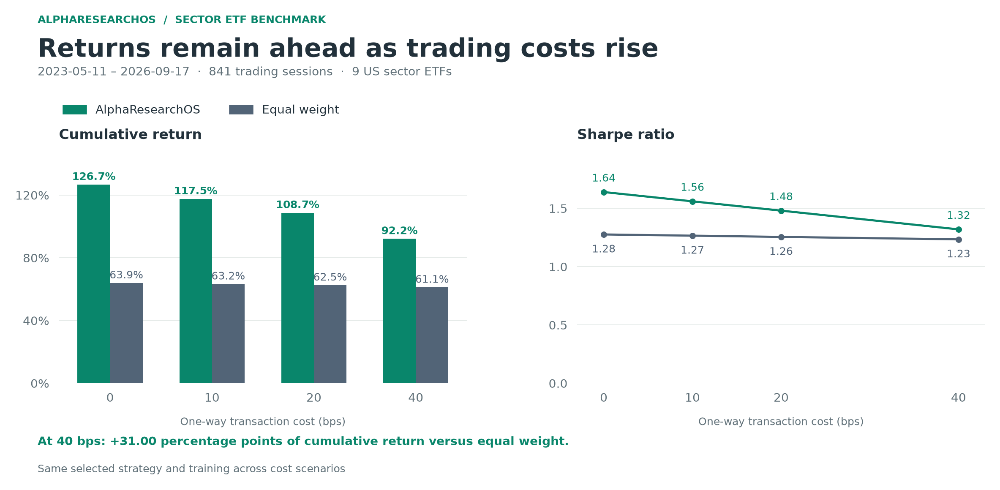

# US sector ETF benchmark

[Home](../README.md) · [Research methods](METHODS.md) · [Benchmark data](../benchmarks/sector-etf/results.json)

AlphaResearchOS achieved **117.53% total return**, **26.22% CAGR**, and a **1.5608 Sharpe ratio** on nine US sector ETFs during **2023-05-11 to 2026-09-17**, after **10 bps one-way transaction costs**. Development scoring selected a two-feature Ridge strategy before holdout evaluation.

## Data and portfolio settings

| Setting | Value |
| --- | --- |
| Market | Nine US sector ETFs: XLB, XLE, XLF, XLI, XLK, XLP, XLU, XLV, XLY |
| Data | Yahoo Finance adjusted daily OHLCV, 2010-01-04 → 2026-09-17; 4,202 sessions |
| Training history | Available observations through 2023-05-08, with matured prediction labels |
| Development evaluation | 2011-01-03 → 2023-05-08; three chronological folds, 3,107 sessions |
| Warmup / separation | 252 sessions / 2 sessions |
| Holdout | 2023-05-11 → 2026-09-17; 841 sessions |
| Portfolio | Long-only; top three equal-weight positions; rebalance every five sessions |
| Execution | Two-session signal lag; 10 bps one-way traded value; cash start and final liquidation |
| Baselines | All-nine-asset equal weight; 20-day and 60-day momentum, each holding the top three |
| Research | Eight attempts; Codex `gpt-6-astra`, medium reasoning; separate proposal and review sessions |

All portfolio comparisons share evaluation dates, signal timing, costs, and liquidation rules. Annualized statistics use 252 trading days and a zero risk-free rate.

## Performance



| Strategy | Total return | CAGR | Sharpe | Max drawdown | Average daily turnover |
| --- | ---: | ---: | ---: | ---: | ---: |
| **AlphaResearchOS · Ridge** | **117.53%** | **26.22%** | **1.5608** | -16.21% | 4.92% |
| Equal weight | 63.22% | 15.81% | 1.2662 | **-15.61%** | 0.51% |
| 20-day momentum | 58.22% | 14.74% | 1.0615 | -21.21% | 13.11% |
| 60-day momentum | 65.63% | 16.32% | 1.1823 | -18.14% | 7.86% |

The strategy's total-return advantage was **54.32 percentage points over equal weight**, **59.31 over 20-day momentum**, and **51.90 over 60-day momentum**. Its daily turnover was lower than both momentum baselines. Maximum drawdown was 0.60 percentage points deeper than equal weight and shallower than both momentum baselines.


The equity chart contains all 841 holdout sessions, with starting capital normalized to one. Turnover uses traded portfolio value and includes entry, drift-aware rebalancing, and final liquidation.

## Cost sensitivity

The same selected strategy was evaluated at four cost levels. Each comparison below uses the equal-weight return at that same cost.



| One-way cost | Strategy return | Strategy CAGR | Sharpe | Max drawdown | Equal-weight return | Return difference |
| --- | ---: | ---: | ---: | ---: | ---: | ---: |
| 0 bps | 126.72% | 27.80% | 1.6403 | -16.03% | 63.91% | +62.81 pp |
| 10 bps | 117.53% | 26.22% | 1.5608 | -16.21% | 63.22% | +54.32 pp |
| 20 bps | 108.72% | 24.67% | 1.4809 | -16.39% | 62.52% | +46.20 pp |
| 40 bps | 92.15% | 21.62% | 1.3202 | -16.74% | 61.15% | +31.00 pp |

At 40 bps, the strategy retained a **31.00-percentage-point** return advantage over equal weight. These cost scenarios were evaluated after candidate selection.

## Strategy

The selected Ridge model combines **smoothed intraday range** with **medium-term trend efficiency**:

```text
0 - mean((high - low) / (close + 1e-06), 60)

delay(ret(close, 60), 5) /
(60 * mean(delay(abs(ret(close, 1)), 5), 60) + 1e-06)
```

```json
{"alpha":100.0,"train_window":756,"retrain_every":63,"horizon":10,"smoothing":15}
```

The model inputs are daily cross-sectional percentile ranks. Feature standardization and Ridge coefficients are fitted on past training samples. The final holdout fit uses a 756-session window with 6,804 pooled samples, ending on 2023-05-08. Predictions throughout the holdout use that fixed fit.

## Development and selection

Candidate selection uses the mean fold Sharpe, fold stability, return difference against equal weight, and a complexity penalty. The selected strategy's final development score was **0.216635**.

| Development fold | Strategy return | Equal-weight return | Difference | Strategy Sharpe | Strategy max drawdown |
| --- | ---: | ---: | ---: | ---: | ---: |
| 2011-01-03 → 2015-02-12 | 42.38% | 77.56% | -35.18 pp | 0.5592 | -28.74% |
| 2015-02-13 → 2019-03-27 | 43.22% | 38.11% | +5.10 pp | 0.7684 | -14.36% |
| 2019-03-28 → 2023-05-08 | 49.08% | 58.99% | -9.90 pp | 0.5072 | -45.18% |

Across the chained development folds, strategy return was 203.99% and equal-weight return was 289.88%. The research-candidate pool selected its highest-scoring approved strategy; fixed baselines remained comparison portfolios. Model fitting was held fixed before each fold, and final holdout evaluation followed selection.

### Candidate history

| Candidate | Model / features | Development score | Outcome |
| --- | --- | ---: | --- |
| T0001 | rank / 3 | 0.078570 | Review requested a revision to align the downside-risk hypothesis and feature |
| T0002 | ridge / 3 | -0.002622 | Approved |
| T0003 | hist_gbdt / 2 | -0.146468 | Approved |
| T0004 | Proposal timeout | — | Failed; request counted |
| T0005 | hist_gbdt / 1 | -0.375349 | Approved; remove short-term deviation |
| **T0006** | **ridge / 2** | **0.216635** | **Approved and selected** |
| T0007 | ridge / 1 | -0.110036 | Approved; remove the separate range feature |
| T0008 | ridge / 2 | 0.141268 | Approved; add downside semivariance |

Seven strategies received reviews, with six approvals and one revision decision. One proposal timed out. The campaign used 15 model requests; 14 returned usage records totaling 256,147 tokens. All 14 candidate–feature entries passed the numerical and causality checks. The review-driven sequence includes a direct ablation of the selected strategy's range feature in T0007.

## Chart data

The compact benchmark files contain portfolio metrics, strategy settings, cost scenarios, development results, and the 841 daily portfolio curves:

- [results.json](../benchmarks/sector-etf/results.json)
- [curves.csv](../benchmarks/sector-etf/curves.csv)
- [plot_benchmark.py](../benchmarks/sector-etf/plot_benchmark.py)

The plotting script renders the figures from these portfolio results. [Research methods](METHODS.md) describe feature evaluation, fitting, selection, and transaction accounting.
